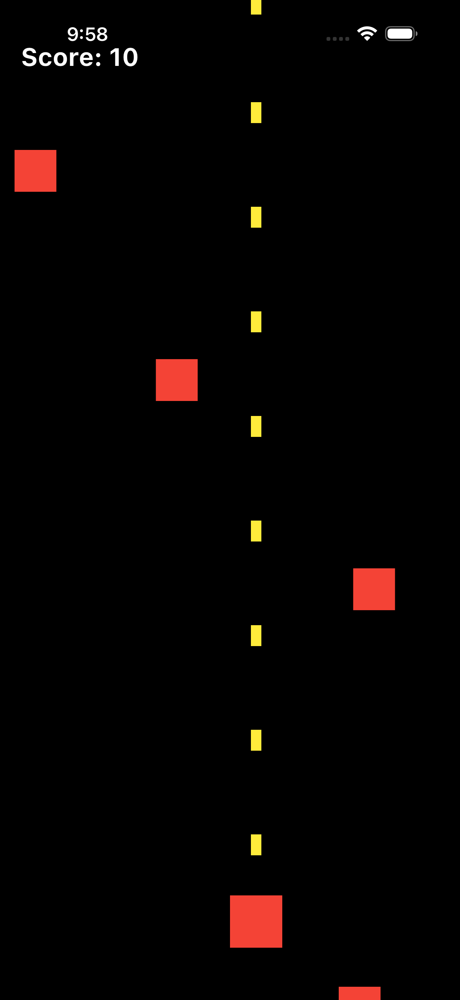

# 2D Space Shooter Game

A 2D space shooter game built using **Flutter** and the **Flame** game engine.

---

## 🎮 Gameplay Screenshot

<p align="center">
  
</p>

---

## ✨ Features

- **Automatic Shooting**: Bullets are fired automatically at a fast, consistent rate (every 0.2 seconds) to keep the action fast-paced.
- **Drag Controls**: Smooth horizontal player control using drag/pan gestures to dodge and line up shots.
- **Dynamic Enemy Spawning**: Enemies spawn continuously at the top of the screen at random horizontal positions.
- **Collision Detection**: Full implementation of Flame's Collision Detection API (`HasCollisionDetection` and `CollisionCallbacks`) to detect bullet impacts on enemies.
- **Score Tracking**: Defeating enemies increases your score, which is updated dynamically and displayed on the screen.

---

## 🛠️ Tech Stack & Architecture

- **Framework**: [Flutter](https://flutter.dev/)
- **Game Engine**: [Flame Engine](https://flame-engine.org/)
- **State & Systems**:
  - `SpaceShooterGame` (extends `FlameGame` with `PanDetector`, `TapCallbacks`, and `HasCollisionDetection`)
  - `Enemy` (Rectangle component with `CollisionCallbacks` and `HasGameReference`)
  - `Bullet` (Rectangle component with `CollisionCallbacks` hitbox)
  - `SpawnComponent` for managing periodic spawns.

---

## 🚀 Getting Started

### Prerequisites

Make sure you have Flutter installed on your machine. You can check the installation guide on the official [Flutter Website](https://docs.flutter.dev/get-started/install).

### Running the Game

1. Clone the repository:
   ```bash
   git clone git@github.com:NishadMiah/2D_space_shooter_game.git
   cd 2D_space_shooter_game
   ```

2. Get the packages:
   ```bash
   flutter pub get
   ```

3. Run the application:
   ```bash
   flutter run
   ```
